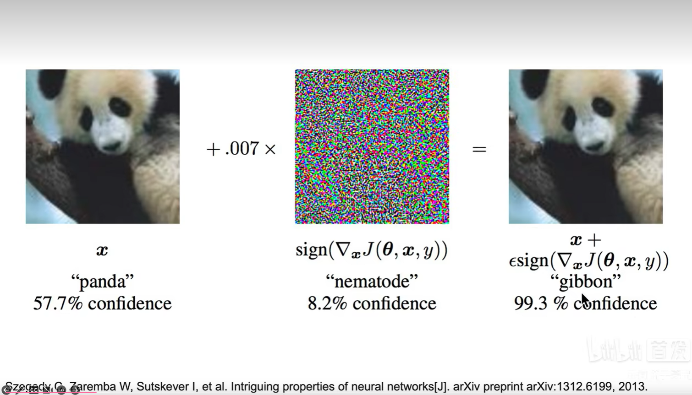

# 预备知识学习

 引入：晴天/黑天 -> 真坦克/假坦克 训练集和测试集一定要来自同一个分布

## 可解释性机器学习

需要注意的问题（举例）：

+ 如何衡量不同特征对AI预测结果的不同贡献
+ AI什么时候work，什么时候不work

添加噪声后 -> 熊猫被误认为长臂猿

## 选择人工智能研究方向的建议

+ 尽可能通用，与其他研究方向交叉
+ 顺应主流发展趋势，长期存在且有用
+ 有高质量的数据集
+ 不过分小众，但也好发paper，没有疯狂内卷
+ 能应用到产业界垂直细分行业
+ 有商业应用价值，容易“讲故事”

## 为什么要学可解释性机器学习

+ 研究AI的本质
+ 机器学习/数据挖掘通用研究方法
+ 和所有AI方向交叉融合

## 从ML到Machine Teaching

[Making a Bird AI Expert Work for You and Me](https://arxiv.org/pdf/2112.02747.pdf)

[2021年深度学习在哪些应用上有实质进展？](https://www.zhihu.com/question/464195262/answer/1989106429)

+ 绝艺围棋
+ 富春山居图
+ 王羲之书法

## 细粒度图像分类

各种例子

## 前沿AI方向

+ ChatGPT
+ AI作画
+ AlphaFold2

大模型的参数规模每年增加10倍

## 本身可解释性好的机器学习算法

Statistical ML:

+ kNN
+ Logistic Regression
+ Linear Regression
+ **If Else If** -> Decision Tree
+ Naive Bayes

## 传统机器学习算法的可解释性分析

+ 算法自带的可视化
+ 算法自带的特征权重
+ Permutation Importance置换重要度（打乱特定特征）
+ PDP图、ICE图
+ Shapley值
+ Lime

可解释性和拟合性：

## 卷积神经网络的可解释性分析

+ 可视化卷积核、特征图

卷积核提取：

浅层：边缘、颜色、斑块等底层像素特征

中层：条纹、纹路、形状等中层纹理特征

高层：眼睛、轮胎、文字等高层语义特征

[Alexnet](https://proceedings.neurips.cc/paper/2012/file/c399862d3b9d6b76c8436e924a68c45b-Paper.pdf)

## 遮挡、缩放、平移、旋转

[Zfnet](https://arxiv.org/pdf/1311.2901v3.pdf)

## 找到使神经元激活的像素/小图

## 基于类激活热力图(CAM)的可视化

[Learning deep features for discriminative localization](https://arxiv.org/pdf/1512.04150.pdf)

## 图像生成

+ 生成哈士奇
+ 对抗样本 -> 熊猫变长臂猿
  + 白盒攻击（已经获取模型内部所有信息和参数）
  + 黑盒攻击

## 综述

[Pytorch CNN Vis](https://github.com/utkuozbulak/pytorch-cnn-visualizations)