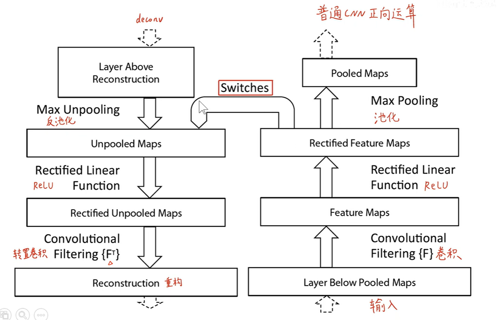
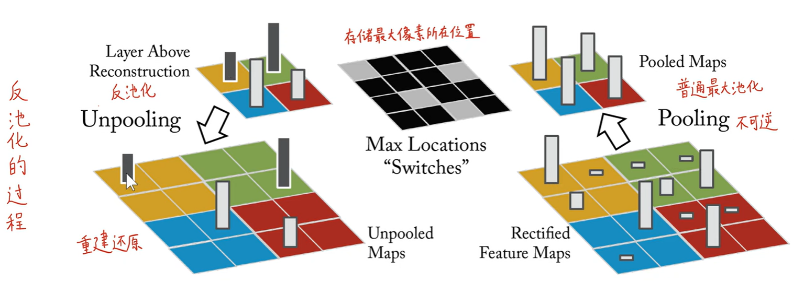
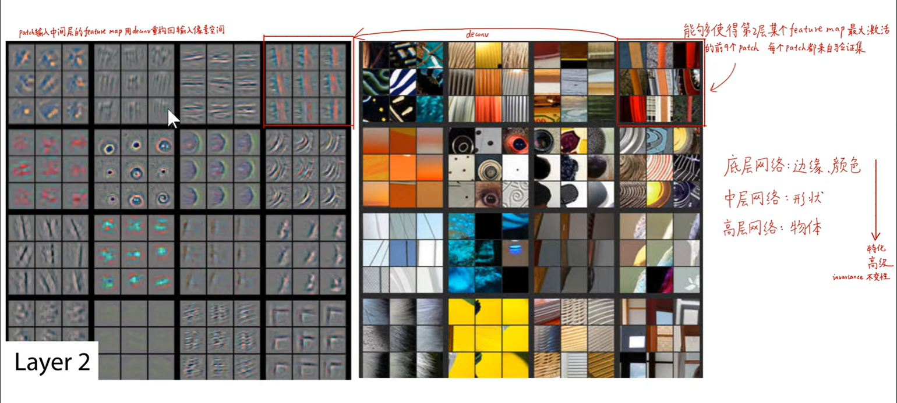
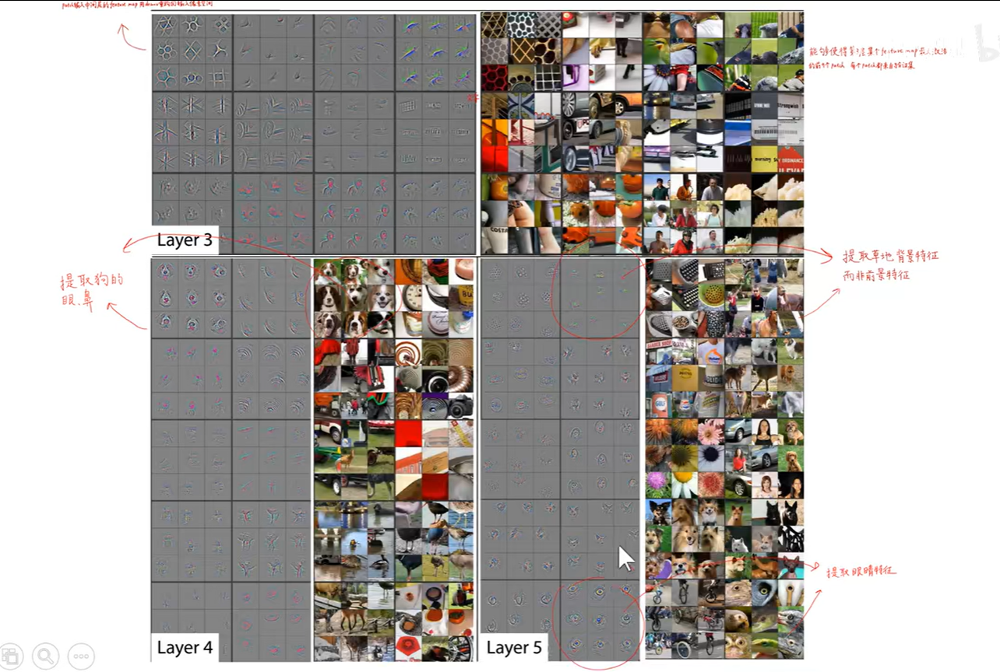

# ZFNET

[Visualizing and Understanding Convolutional Networks](https://arxiv.org/pdf/1311.2901.pdf)

改变了Alexnet的参数，进行了小修小改

重点是**可视化技巧**

反池化

第1层卷积核 边缘颜色

第2层用上反卷积技巧

呈现对应关系

层数越深提取的体征越高级、越倾向于语义

## 特征演化

横向表示训练的过程

低层收敛很快

计算feature vector欧式距离：

平移/缩放/旋转都会导致迅速扩大

浅层 -> 显著差异(facial)

深层 -> 线性差异(semantic)

需要对卷积核进行大小裁剪

第一层卷积核改小，步长改小

## 遮挡测试

### 敏感度分析

例：网络对于狗脸的关注

中间图为使得同样fisher map最大化激活的其他图片（毛+文字+脸）

### 相关性分析

遮挡差值即$epsilon$

如果对不同类型的狗遮挡同样位置基本一致，差值很小，则深度学习模型隐式地定义不同部位的相关性

## 模型效果

既去掉卷积层，又去掉全连接层，误差非常大

只改softmax分类层（微调和pretrain)，泛化效果非常好

越深的层越有效（softmax/支持向量机验证）

越深，information越discriminative